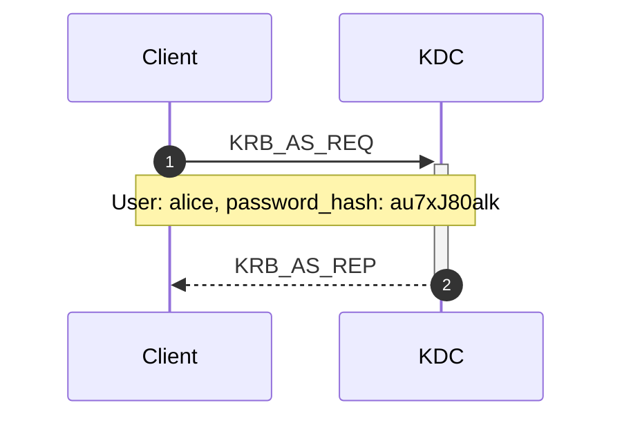
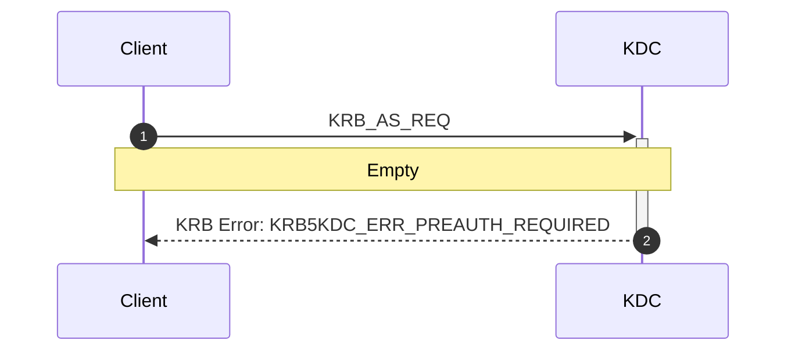
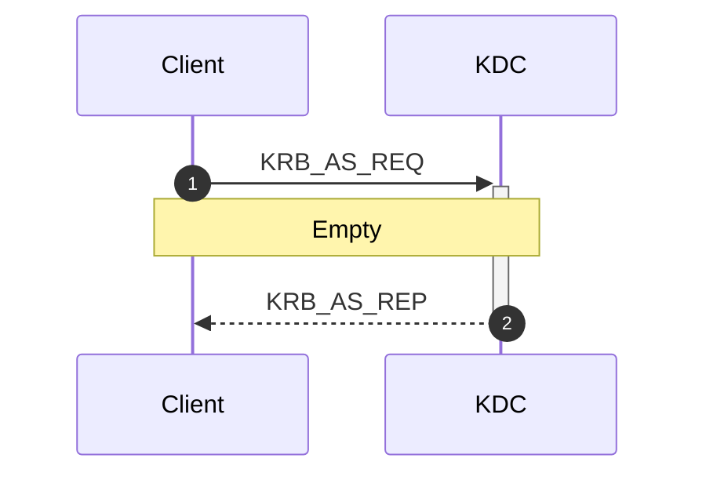

# pen-cheatsheets

## Active Directory

### Kerberosを利用したユーザー列挙
Kerberos = Active Directoryの鍵認証サービス<br>
Kerberosは標準で88番、464番ポートを使用するためこのポートが開いている場合、『Kerbrute』が使用できる。<br>  
https://github.com/ropnop/kebrute

Kerbruteの『userenum』コマンドを使用する。

```
$ kerbrute userenum -d [domain name] --dc [dc name] [user_list]

Usage:
  Kerbrute userenum [flags] <username_wordlist>
  
  -d The full domain to use (e.g. contoso.com)
```

#### Kerbruteを使用したユーザー列挙
1. KerbruteがTGTリクエストをpre-authentication(事前認証)無しで送信する。
2. KDCのレスポンスが『PRINCIPAL UNKNOWN』エラーだった場合、そのユーザーは存在しない。<br>
   KDCがpre-authenticationを促してきた場合、そのユーザーは存在する。<br>
   この操作によりログインが失敗することはないため、アカウントロックアウトは起きない。<br>
   Kerberosのロギングが有効になっている場合、この操作によってWindowsイベントのID4768が生成される。


#### GetNPUsers.pyを使用したKerberosへの攻撃
Impacket内にあるGetNPUSers.pyを使用してKDCへ『ASReproastable』アカウントを照会する。<br>
この手順で前段で列挙したユーザー名リストが必要
『ASReproastable』とはユーザーアカウントに対してpre-authenticationを必要としない特権が設定されている状態。
Kerberos認証のログインでは最初にKDCへ『KRB_AS_REQ』を送信する。<br>
この時KDCでは通常、idとpassword hashを確認して『KRB_AS_REP』を返却してくるが、対象ユーザーがASREPRoastableの場合、
認証無しでKRB_AS_REPを返却する。<br>
このようなユーザーをGetNPUsers.pyは列挙してくれる。

### pre-authenticationが有効なアカウントの場合
認証情報を提供した場合にKRB_AS_REPが返却され、TGTが取得できる


認証情報を提供しない場合ERR_PREAUTH_REQUIREDが返却され、TGTが取得できない


### pre-autenticationが無効なアカウントの場合
認証情報を提供しない場合でもKRB_AS_REPが返却され、TGTが取得できてしまう


### ASREPRoarstableアカウントを利用したTGTの取得
```
$ GetNPUsers.py [domain name/user name] -no-pass
```

成功すると以下の形式でhashが出力される。
```
$krb5asrep$23$user@domain:hash
```

johnで解析

```
$ john hash.txt --wordlist=password_list.txt
```
